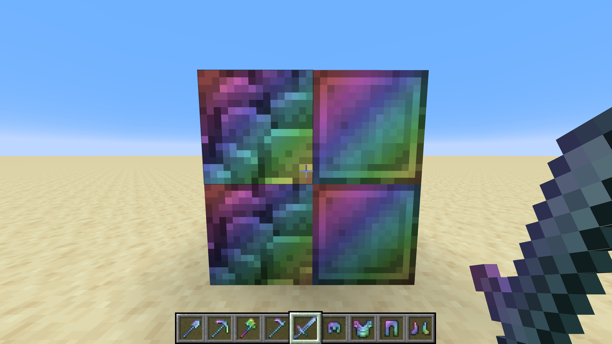

# Rainbow Netherite

Make netherite a shimmering rainbow gradient, so you can easily find ancient debris and loop swagger.

## Instructions to download
- Made for: Minecraft 1.21
- Download the repo, drag the `RainbowNetherite` folder into `minecraft/resourcepacks`.
